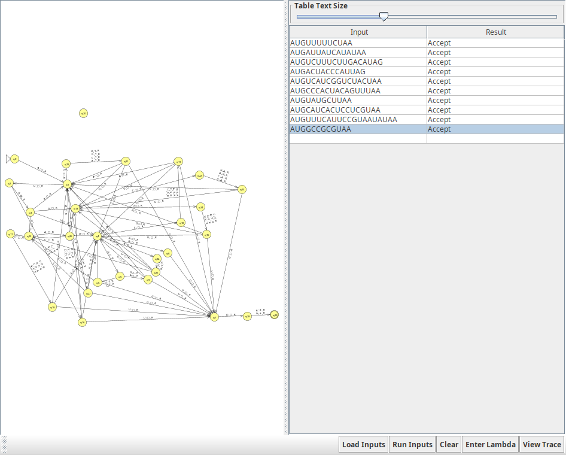
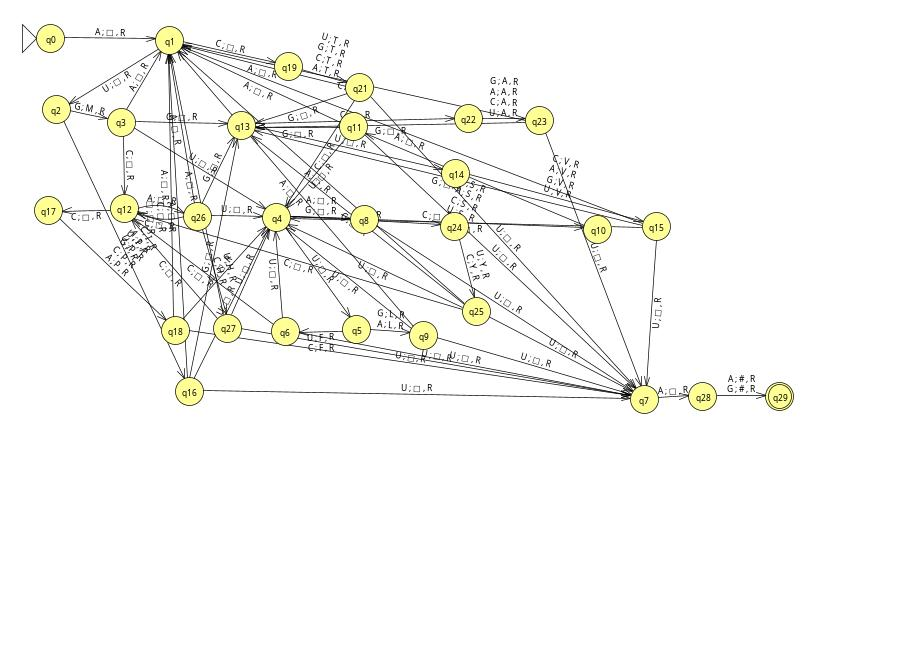

# Maquina de Turing: ARN a Proteinas

## Intro

* La traducción del ARN a proteínas es el proceso mediante el cual la información genética codificada en la secuencia de ARN mensajero (ARNm) se utiliza para sintetizar proteínas específicas
* Este proceso ocurre en los ribosomas, que actúan como las fábricas celulares de proteínas. Durante la traducción, los ribosomas leen secuencialmente los codones del ARNm y utilizan el código genético para ensamblar una cadena polipeptídica de aminoácidos, siguiendo las reglas de correspondencia entre los codones y los aminoácidos especificados por el ARN de transferencia (ARNt)

| Codón de ARN                 | Aminoácido          |
|------------------------------|---------------------|
| AUG                          | M (Metionina)       |
| UUU, UUC                     | F (Fenilalanina)    |
| UUA, UUG, CUU                | L (Leucina)         |
| UCU, UCC, UCA,               | S (Serina)          |
| UAU, UAC                     | Y (Tirosina)        |
| UGU, UGC                     | C (Cisteína)        |
| UGG                          | W (Triptófano)      |
| CCU, CCC, CCA, CCG           | P (Prolina)         |
| CAU, CAC                     | H (Histidina)       |
| CAA, CAG                     | Q (Glutamina)       |
| CGU, CGC, CGA, CGG, AGA, AGG | R (Arginina)        |
| AUU, AUC, AUA                | I (Isoleucina)      |
| ACU, ACC, ACA, ACG           | T (Treonina)        |
| AAU, AAC                     | N (Asparagina)      |
| AAA, AAG                     | K (Lisina)          |
| GAU, GAC                     | D (Ácido aspártico) |
| GAA, GAG                     | E (Ácido glutámico) |
| UAA, UAG, UGA                | # (Parada)          |

### Nucleótidos

* A = Adenina
* C = Citosina
* G: Guanina
* U: Uracilo

* Codon de Inicio: **AUG**
* Codones de terminación: **UUU**, **UAG**, **UGA**

### Cadena ARN

* ***AUGGCUAAGUUUUAA*** (cadena) -> ***MAK*** (traducion de proteina)

## MT1

## MT2

## Simulator

[Programa](./resources/simulator.mt)
