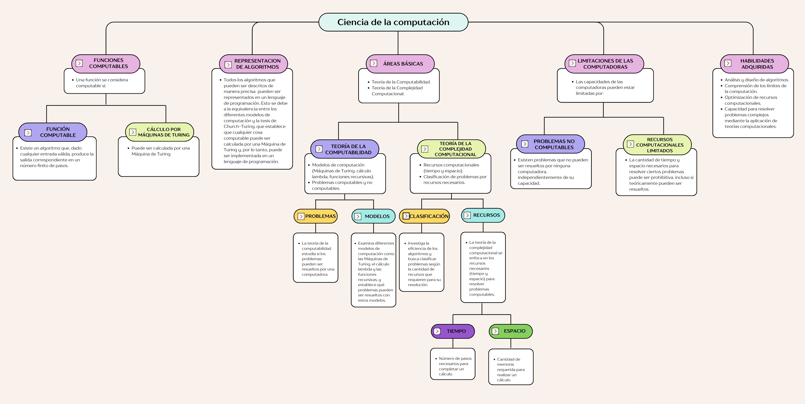
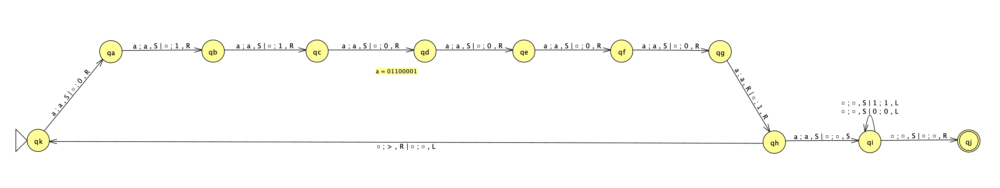
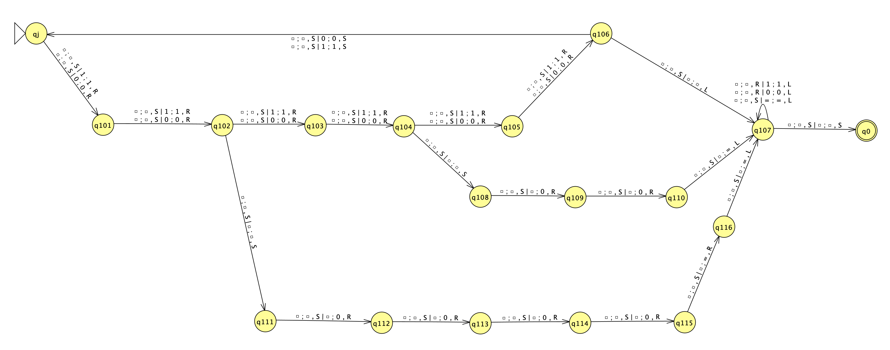
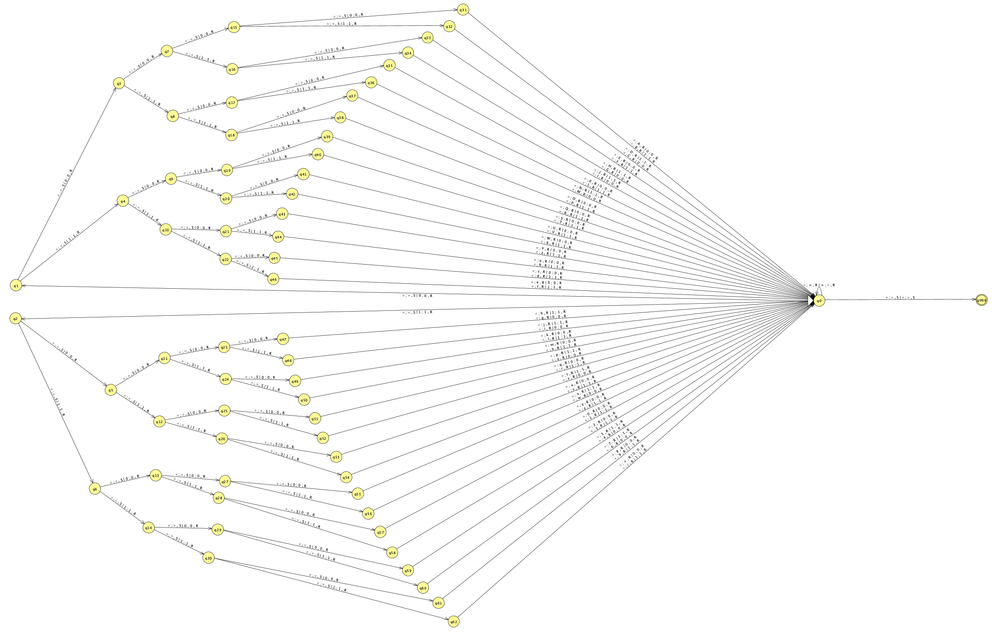

# Máquina de Turing: ASCII a Base64

## Mapa conceptual

## Nombre

Convertir ASCII a base64. Esta maquina de Turing convierte un texto ASCII a base64 utilizando una mt de dos cintas. Para simplificar la mt, solo se puede convertir palabras en minusculas y sin espacios

## Función que computa

Convertir un texto ASCII a base64, mediante los siguientes pasos:

1. Convertir cada caracter del texto a su valor ASCII
1. Convertir cada valor ASCII a binario de 8 bits
1. Agrupar los valores binarios en grupos de 6 bits
1. Completar con ceros a la derecha si es necesario
1. Convertir cada grupo de 6 bits a su valor decimal
1. Convertir cada valor decimal a su valor base64
1. Concatenar los valores base64
1. Si el texto no tiene una cantidad de caracteres múltiplo de 3, se deben agregar caracteres de relleno. En el caso de que falte un caracter, se debe agregar un signo de igual (=). Si faltan dos caracteres, se deben agregar dos signos de igual
1. El texto convertido a base64 es el resultado final

## JFlap

Para diseñar la máquina de Turing que convierte un texto ASCII a base64, se divide el proceso en tres partes que estan concatenadas o sea que la salida de una parte es la entrada de la siguiente parte

1. Convertir cada caracter del texto a su valor ASCII binario de 8 bits
    * 
    * JFLAP: [ASCII a binario](./resources/diagrama_ascii_bin.jff)
    * En este paso, la máquina de Turing recibe un caracter del texto y lo convierte a su valor ASCII binario de 8 bits. Luego, se desplaza a la derecha para leer el siguiente caracter. Para simplificar el diagrama solo se describen los estados para convertir el caracter 'a' a su valor ASCII binario '01100001'. El proceso se repite para los demás caracteres
1. Convertir los valores binarios en grupos de 6 bits
    * 
    * JFLAP: [Adaptador 8bits a 6bits](./resources/diagrama_adapter.jff)
    * En este paso, la máquina de Turing recibe una cadena de 8 bits y lo convierte en grupos de 6 bits. En el caso de que la cadena no sea múltiplo de 6, se agregan ceros a la derecha. En caso de agregar dos ceros, también se agrega el simbolo '=' como caracter de relleno. En el caso de agregar cuatro ceros, se agregan dos simbolos '=' como caracteres de relleno. Luego, se desplaza a la derecha para leer el siguiente grupo de 8 bits
1. Convertir cada grupo de 6 bits a su valor ASCII
    * 
    * JFLAP: [binario a base64](./resources/diagrama_base64.jff)
    * En este paso, la máquina de Turing recibe una cadena multiplo de 6 bits y lo convierte en su valor ASCII utilizando un arbol binario. Luego, se desplaza a la derecha para leer el siguiente grupo de 6 bits

## Programa Simulator

El programa Simulator es una implementación de la máquina de Turing que convierte un texto ASCII a base64. El programa recibe como entrada un texto ASCII y devuelve el texto convertido a base64

[ASCII a base64](./resources/ascii_base64.mt)

## Inputs: configuraciones de computación

palabra | base64
--- | ---
a | YQ==
mt | bXQ=
par | cGFy
hola | aG9sYQ==
cinco | Y2luY28=
teoria | dGVvcmlh
ciencia | Y2llbmNpYQ==
colchita | Y29sY2hpdGE=
computado | Y29tcHV0YWRv
hurlingham | aHVybGluZ2hhbQ==

## Complejidad Temporal

Observamos cómo aumenta la complejidad temporal a medida que crece la longitud de la palabra:

w entrada | longitud entrada | w salida | longitud salida | Comp. Temporal | Incremento
--- | --- | --- | --- | --- | ---
a | 1 | YQ== | 4 | 63 | -
mt | 2 | bXQ= | 4 | 96 | 33
par | 3 | cGFy | 4 | 130 | 34
hola | 4 | aG9sYQ== | 8 | 190 | 60
cinco | 5 | Y2luY28= | 8 | 223 | 33
teoria | 6 | dGVvcmlh | 8 | 257 | 34
ciencia | 7 | Y2llbmNpYQ== | 12 | 317 | 60
colchita | 8 | Y29sY2hpdGE= | 12 | 350 | 33
computado | 9 | Y29tcHV0YWRv | 12 | 384 | 34
hurlingham | 10 | aHVybGluZ2hhbQ== | 16 | 444 | 60

Los incrementos se alternar entre `33`, `34`, y `60`. Observando este patrón, determinamos que la complejidad temporal es lineal con fluctuaciones periódicas. El tiempo aumenta proporcionablemente a la longitud de la palabra, se presenta una **complejidad temporal lineal (O(n))**

## Complejidad Espacial

Observamos cómo aumenta la complejidad espacial a medida que crece la longitud de la palabra:

Long. w entrada | separador | logn. w salida | blanco cinta #1 | blanco cinta #2 | bits | simbolo = | total | incremento
--- | --- | --- | --- | --- | --- | --- | --- | ---
1 | 1 | 4 | 2 | 2 | 12 | 2 | 24 | -
2 | 1 | 4 | 2 | 2 | 18 | 1 | 30 | 6
3 | 1 | 4 | 2 | 2 | 24 | 0 | 36 | 6
4 | 1 | 8 | 2 | 2 | 36 | 2 | 55 | 19
5 | 1 | 8 | 2 | 2 | 42 | 1 | 61 | 6
6 | 1 | 8 | 2 | 2 | 48 | 0 | 67 | 6
7 | 1 | 12 | 2 | 2 | 60 | 2 | 86 | 19
8 | 1 | 12 | 2 | 2 | 66 | 1 | 92 | 6
9 | 1 | 12 | 2 | 2 | 72 | 0 | 98 | 6
10 | 1 | 16 | 2 | 2 | 84 | 2 | 117 | 19

Los incrementos se alternar entre `6` y `19`. Observando este patrón, determinamos que la complejidad espacial es lineal con fluctuaciones periódicas. El espacio aumenta proporcionablemente a la longitud de la palabra, se presenta una **complejidad espacial lineal (O(n))**
