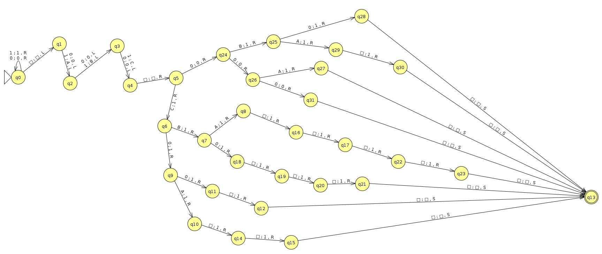
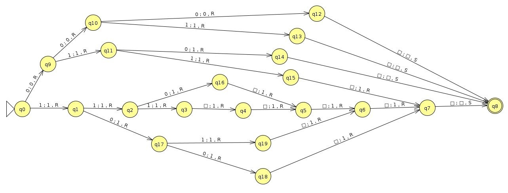

# Máquinas de Turing: Binario a Unario

## Máquina 1

* **Nombre**: "Máquina de Turing de Conversión Binario de 3 bits a Unario"
* **Función que computa**: La función que computa esta máquina es convertir un número en representación binaria de 3 bits (000 a 111) a su equivalente en representación unaria. Por ejemplo, el número binario 011 (que es 3 en decimal) se convertirá en 111 en unario.
* **Descripción**: La máquina primero va al final del número, asigna según su posición una letra (de derecha a izquierda) y luego va agregando tantos unos como la letra lo requiera. La asignacion sería de la siguiente manera:
  * Si encuentra una letra A, agregará un solo 1, (por 2^0).
  * Si encuentra una letra B, agregará 2 unos, (por 2^1).
  * Si encuentra una letra C, agregará 4 unos, (por 2^2).
  * Si encuentra en cualquier caso encuentra un 0, seguirá agregando los unos faltantes de la letra anterior.
  * De esta manera la máquina hace la conversión de un sistema numérico a otro.
* **Formalismo**: MT = < Г, Σ, b, Q, q_0, F, δ>
  * Alfabeto de la cinta: Г = {0, 1, A, B, C, _}
  * Alfabeto de entrada: Σ  = {0, 1}
  * Símbolo blanco: b = _
  * Conjunto de estados: Q = {q0, q1, q2, q3, q4, q5, q6, q7, q8, q9, q10, q11, q12, q13, q14, q15, q16, q17, q18, q19, q20, q21, q22, q23, q24, q25, q26, q27, q28, q29, q30, q31}
  * Estado inicial: q0 = q0
  * Estado final: F = {q13}
  * Transiciones:
    * δ (q0, 0) = (q0, 0, R)
    * δ (q0, 1) = (q0, 1, R)
    * δ (q0, _) = (q1, _, L)
    * δ (q1, 0) = (q2, 0, L)
    * δ (q1, 1) = (q2, A, L)
    * δ (q2, 1) = (q3, B, L)
    * δ (q2, 0) = (q3, 0, L)
    * δ (q3, 1) = (q4, C, L)
    * δ (q3, 0) = (q4, 0, L)
    * δ (q4, _) = (q5, _, R)
    * δ (q5, C) = (q6, 1, R)
    * δ (q6, 0) = (q9, 1, R)
    * δ (q9, A) = (q10, 1, R)
    * δ (q10, _) = (q14, 1, R)
    * δ (q14, _) = (q15, 1, R)
    * δ (q15, _) = (q13, _, S)
    * δ (q9, 0) = (q11, 1, R)
    * δ (q11, _) = (q12, 1, R)
    * δ (q12, _) = (q13, _, S)
    * δ (q6, B) = (q7, 1, R)
    * δ (q7, 0) = (q18, 1, R)
    * δ (q18, 1) = (q19, 1, R)
    * δ (q19, _) = (q20, 1, R)
    * δ (q20, _) = (q21, 1, R)
    * δ (q21, _) = (q13, _, S)
    * δ (q7, A) = (q8, 1, R)
    * δ (q8, _) = (q16, 1, R)
    * δ (q16, _) = (q17, 1, R)
    * δ (q17, _) = (q22, 1, R)
    * δ (q22, _) = (q23, 1, R)
    * δ (q23, _) = (q13, _, S)
    * δ (q5, 0) = (q24, 0, R)
    * δ (q24, 0) = (q26, 0, R)
    * δ (q26, 0) = (q31, 0, R)
    * δ (q31, _) = (q13, _, S)
    * δ (q26, A) = (q27, 1, R)
    * δ (q27, _) = (q13, _, S)
    * δ (q26, A) = (q27, 1, R)
    * δ (q27, _) = (q13, _, S)
    * δ (q24, B) = (q25, 1, R)
    * δ (q25, A) = (q29, 1, R)
    * δ (q29, _) = (q30, 1, R)
    * δ (q30, _) = (q13, _, S)
    * δ (q25, 0) = (q28, 1, R)
    * δ (q28, _) = (q13, _, S)
* **Diseño en JFlap**: 
* **Programa Simulator**: [Programa Simulator de M1](./resources/M1-simulator.mt)
* **Inputs**:
  
  
  
  
  
  
  
  
  
  

* **Complejidad temporal**: 𝑂(𝑛), expresado en términos de 𝑛 = 4 + 19 transiciones (máximo)
* **Complejidad espacial**: Si esta máquina de Turing utiliza 𝑛 = 3 + 4 celdas, entonces la complejidad espacial es 𝑂(𝑛)

## Máquina 2

* **Nombre**: "Máquina de Turing de Conversión Binario de 3 bits a Unario mejorada"
* **Función que computa**: La función que computa esta máquina es convertir un número en representación binaria de 3 bits (000 a 111) a su equivalente en representación unaria.
* **Descripción**: Al saber que la entrada será solo de 3 bits, no hace falta que la máquina vaya primero al final del número, ya se sabe que si lee un 1 en la primer posición, debe escribir cuatro 1 (por 2^2), si lo lee en en la segunda posición deberá escribir dos 1 (por 2^1), y si lo lee en la tercera posición escribirá solo un 1. De esta manera la máquina hace la conversión de un sistema numérico a otro.
* **Formalismo**: MT = < Г, Σ, b, Q, q_0, F, δ>
  * Alfabeto de la cinta: Г = {0, 1, _}
  * Alfabeto de entrada:  Σ = {0, 1}
  * Símbolo blanco: b = _
  * Estados: Q = {q0, q1, q2, q3, q4, q5, q6, q7, q8, q9, q10, q11, q12, q13, q14, q15, q16, q17, q18}
  * Estado inicial: q0 = q0
  * Estado final: F = {q8}
  * Transiciones:
    * δ (q0, 1) = (q1, 1, R)
    * δ (q1, 1) = (q2, 1, R)
    * δ (q2, 1) = (q3, 1, R)
    * δ (q3, _) = (q4, 1, R)
    * δ (q4, _) = (q5, 1, R)
    * δ (q5, _) = (q6, 1, R)
    * δ (q6, _) = (q7, 1, R)
    * δ (q7, _) = (q8, _, S)
    * δ (q2, 0) = (q16, 1, R)
    * δ (q16, _) = (q5, 1, R)
    * δ (q1, 0) = (q17, 1, R)
    * δ (q17, 1) = (q19, 1, R)
    * δ (q19, _) = (q6, 1, R)
    * δ (q17, 0) = (q18, 1, R)
    * δ (q18, _) = (q7, 1, R)
    * δ (q0, 0) = (q9, 0, R)
    * δ (q9, 1) = (q11, 1, R)
    * δ (q11, 1) = (q15, 1, R)
    * δ (q15, _) = (q7, 1, R)
    * δ (q11, 0) = (q14, 1, R)
    * δ (q14, _) = (q8, _, R)
    * δ (q9, 0) = (q10, 0, R)
    * δ (q10, 0) = (q12, 0, R)
    * δ (q12, _) = (q8, _, S)
* **Diseño en JFlap**: 
* **Programa Simulator**: [Programa Simulator de M2](./resources/M2-simulator.mt)
* **Inputs**:
  
  
  
  
  
  
  
  
  
  

* **Complejidad temporal**: 𝑂(𝑛), expresado en términos de 𝑛 = 4 + 11 transiciones (máximo)
* **Complejidad espacial**: Si esta máquina de Turing utiliza 𝑛 = 3 + 4 celdas, entonces la complejidad espacial es 𝑂(𝑛)

## Comparación de máquinas de Turing

Evaluamos en términos de su complejidad espacial y temporal, a pesar de que ambas tienen la misma complejidad asintótica (notación que se utiliza para describir el comportamiento de un algoritmo a medida que el tamaño de la entrada crece).

### Complejidad Espacial

* Máquina 1: Utiliza 3𝑛+4 celdas.
* Máquina 2: Utiliza 3𝑛+4 celdas.
* En términos de complejidad espacial, ambas máquinas son equivalentes, ya que ambas tienen una complejidad espacial de 𝑂(𝑛).

### Complejidad Temporal

* Máquina 1: Realiza 4𝑛+19 transiciones.
* Máquina 2: Realiza 4𝑛+11 transiciones.
* Ambas máquinas tienen una complejidad temporal de 𝑂(𝑛).

Sin embargo, para entradas de tamaño 𝑛, la Máquina 2 realiza menos transiciones que la Máquina 1. La diferencia en las constantes (19 para la Máquina 1 y 11 para la Máquina 2) indica que la Máquina 2 es más eficiente en términos de transiciones, ya que realiza menos movimientos para procesar la misma entrada.

Esto se traduce en una operación más rápida y eficiente en la práctica, aunque la diferencia se haría más notable para entradas de mayor tamaño.

Por lo tanto, basándonos en la eficiencia temporal práctica, la Máquina 2 es la mejor opción de las dos.
