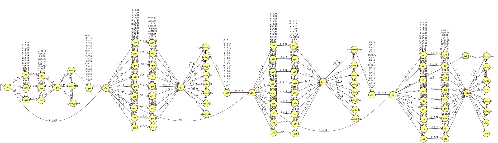

# Máquina de Turing: Números decimales a números romanos

## Función que Computa

La función principal de esta Máquina de Turing es recibir un número decimal (representado en base 10) y transformarlo en su equivalente en numeración romana, generando la salida en la cinta de la maquina.

### Estrategia de diseño

* La entrada es un número decimal, con un # como separador (por ejemplo, "1987#").
* La máquina lee la entrada dígito por dígito y la almacena en su cinta.

### Limitacion

* La maquina espera como entrada 4 digitos decimales mas el simbolo #.
* Por ejemplo: 0000#, 0500#, 0010#, etc.
* De esta forma la maquina puede entender cual es el digito que se esta convirtiendo. (Millar, centena, decena, unidad)

### Conversión de Dígitos

La máquina de Turing sigue un conjunto de reglas para traducir cada dígito según su posición (millares, centenas, decenas, unidades).  
Utiliza reglas como:

* **Unidades**: `1 → I`, `2 → II`, `3 → III`, ..., `9 → IX`
* **Decenas**: `10 → X`, `20 → XX`, ..., `90 → XC`  
* **Centenas**: `100 → C`, `200 → CC`, ..., `900 → CM`  
* **Millares**: `1000 → M`, `2000 → MM`, `3000 → MMM`  

### Salida

La máquina escribe la salida en la cinta, reemplazando cada dígito por su equivalente en números romanos.  

Ejemplo para **1987#**:

* `1000 → M`
* `900 → CM`
* `80 → LXXX`
* `7 → VII`
* **Resultado:** `#MCMLXXXVII`

## Límite de 3999 en los Números Romanos

El sistema de numeración romana clásico no incluye un símbolo específico para 5000 ni para potencias mayores de 10.  
Los números superiores a 3999 requieren una notación especial con líneas sobre los símbolos para multiplicarlos por 1000 (por ejemplo, `V̅` para representar `5000`).  

La máquina desarrollada se basa en la notación romana convencional sin líneas o simbolos especiales, el máximo número que puede representar es **3999 (`MMMCMXCIX`)**.

---

## Diseño JFlap

## Programa Simulator

El programa leerá un número decimal, simulará el comportamiento de la máquina y devolverá el resultado en numeración romana.

[Archivo SIMULADOR](resources/simulador.mt)

---

## Inputs

| Entrada  | Salida            | Movimientos| Celdas + 4|
|----------|-------------------|------------|--------|
| 0000#     | #                |4           |1       |
| 0004#     | #IV              |9           |3       |
| 0009#     | #IX              |9           |3       |
| 0014#     | #XIV             |19          |4       |
| 0040#     | #XL              |15          |2       |
| 0055#     | #LV              |18          |3       |
| 0067#     | #LXVII           |23          |6       |
| 0090#     | #XC              |15          |3       |
| 0275#     | #CCLXXV          |43          |7       |
| 0318#     | #CCCXVIII        |45          |9       |
| 0456#     | #CDLVI           |38          |6       |
| 0500#     | #D               |15          |2       |
| 1000#     | #M               |17          |2       |
| 1234#     | #MCCXXXIV        |62          |9       |
| 1546#     | #MDXLVI          |54          |7       |
| 1987#     | #MCMLXXXVII      |66          |11      |
| 2000#     | #MM              |19          |3       |
| 2024#     | #MMXXIV          |43          |7       |
| 2356#     | #MMCCCLVI        |68          |9       |
| 2500#     | #MMD             |34          |4       |
| 2751#     | #MMDCCLI         |67          |8       |
| 3000#     | #MMM             |21          |4       |
| 3237#     | #MMMCCXXXVII     |77          |12      |
| 3542#     | #MMMDXLII        |68          |9       |
| 3750#     | #MMMDCCL         |63          |8       |
| 3888#     | #MMMDCCCLXXXVIII |91          |16      |
| 3999#     | #MMMCMXCIX       |73          |10      |

---

## Complejidad Temporal

Dado un algoritmo, la **complejidad temporal** es la cantidad de pasos, operaciones o acciones elementales que debe realizar el algoritmo al ser ejecutado en una instancia.

* Los números romanos pueden tener una representación más larga que los decimales (por ejemplo, `3888 → "MMMDCCCLXXXVIII"` con 15 caracteres), la máquina de Turing necesita moverse múltiples veces sobre la cinta para insertar los caracteres correctos.
* La conversión implica principalmente **buscar equivalencias y escribir símbolos en la cinta**, lo que requiere movimientos proporcionales al número de caracteres generados.

La complejidad temporal no muestra un patrón exacto, debido a las reglas de conversión de números decimales a números romanos. La representación de ciertos números, como 10, 500, 1000, 3000, etc. requieren transiciones que no escalan linealmente con el tamaño de la entrada. La presencia de estos números, como casos especiales, genera picos en la cantidad de transiciones y afecta significativamente la forma del grafico de complejidad temporal.

---

## Complejidad Espacial

La **complejidad espacial** mide cuánta memoria (**longitud de la cinta de la Máquina de Turing**) se usa durante la computación.

* La cantidad de espacio requerido depende de la longitud de la representación en números romanos.
* En el peor caso, un número decimal de **4 dígitos** puede convertirse en un número romano de hasta **15 caracteres** (ejemplo: `3888 → "MMMDCCCLXXXVIII"`).

La complejidad espacial no es exacta, esta depende de la cantidad de caracteres que se escriben en la cienta, y la cantidad de caracteres que se escriben, depende de las reglas de conversión de los números romanos y estas no son lineales.
