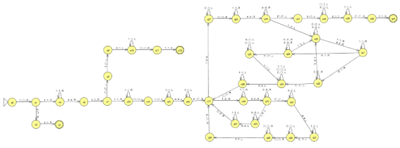
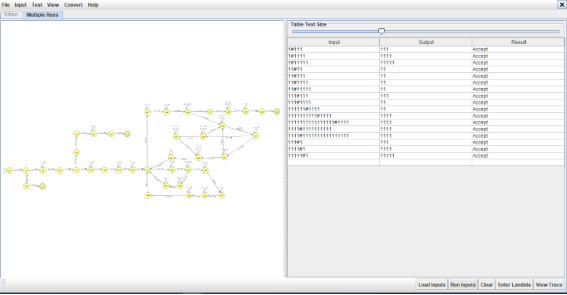
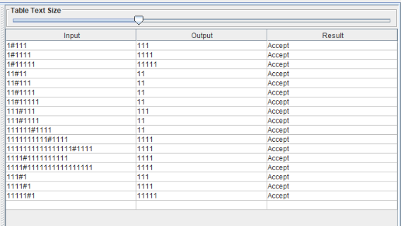
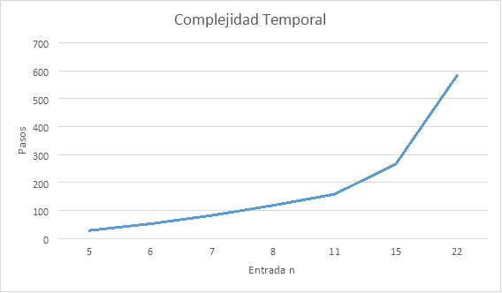


# Máquina de Turing Algoritmo de Euclides (resta)

## Objetivo

Encontrar el máximo común divisor “mcd” utilizando como referencia el Algoritmo de Euclides con restas sucesivas.

La notación utilizada es unaria, donde los números tienen la siguiente representación:

0 = 1

1 = 11

2 = 111

3 = 1111

4 = 11111

n = 1n 1’s  

La entrada queda representada por dos números separados por #.

Por ejemplo: mcd (5,3) = 1

|Entrada|Salida|
| :- | :- |
|111111#1111|11|

## Estrategia

1. Sacar los 1’s que representan al 0 en ambos números
    * 11111#111

2. Marcar el primer símbolo del primer número con C y marcar el primer símbolo del segundo número con X
    * C1111#X11

3. Se marcan uno a uno hasta que uno de ellos no tiene símbolos por marcar con lo cual es el número más pequeño y debe restarse
   * CCC11#XXX

4. Se resta el número más pequeño. En este caso las X’s se transforman en 1’s y las C’s se borran pasando a ser blanco en la cinta
    * 11#111

5. Vuelve al paso 2

Cuando los números son iguales 111#111 significa que el mcd es ese número, quedaría CCC#XXX, por lo que se borran las X’s del segundo número, el separador # se transforma en 1 para respetar la notación y las C’s pasan a 1’s quedando en la cinta de la máquina 1111, es decir el número 3.  

## JFLAP

## Inputs: Configuraciones de Computación

|**n**|**Conf. Inicial**|**Conf. Final**|**Espacios**|**Pasos**|**Estado**|
| :- | :- | :- | :- | :- | :- |
|5|1#111|111|6|3|Aceptado|
|6|1#1111|1111|7|3|Aceptado|
|7|1#11111|11111|8|3|Aceptado|
|5|11#11|11|6|28|Aceptado|
|6|11#111|11|7|52|Aceptado|
|7|11#1111|11|8|82|Aceptado|
|8|11#11111|11|9|118|Aceptado|
|7|111#111|111|8|46|Aceptado|
|8|111#1111|11|9|91|Aceptado|
|11|111111#1111|11|12|158|Aceptado|
|15|1111111111#1111|1111|16|242|Aceptado|
|22|1111111111111111#1111|1111|23|512|Aceptado|
|15|1111#1111111111|1111|16|266|Aceptado|
|22|1111#1111111111111111|1111|23|584|Aceptado|
|5|111#1|111|6|12|Aceptado|
|6|1111#1|1111|7|14|Aceptado|
|7|11111#1|11111|8|16|Aceptado|

## Simulator

## Complejidad Espacial

Dada la entrada n la complejidad espacial de la máquina de Turing es:

S(n) = O(n+1)

|**n (entrada)**|**Espacios**|
| :- | :- |
|5|6|
|6|7|
|7|8|
|8|9|
|11|12|
|15|16|
|22|23|
|40|41|
|60|61|
|80|81|

## Complejidad temporal

La complejidad temporal se puede dividir en 3 partes: caso base 1, caso base 2, otros casos.

* mdc(c,d)

* **Caso base 1: c = 0 ^ d >= 0**

T(n) = 3

* **Caso base 2: c > 0 ^ d = 0**

T(n) = T(2n+4)

|**Entrada**|**n**|**Pasos**|
| :-: | :-: | :-: |
|11#1|4|12|
|111#1|5|14|
|1111#1|6|16|
|11111#1|7|18|
|111111#1|8|20|
|1111111#1|9|22|

* **Otros casos: c > 0 ^ d > 0**

En estos casos la complejidad espacial no se puede calcular de forma precisa, es aleatoria. De acuerdo a los valores obtenidos podemos deducir que es exponencial.

|**n**|**Pasos**|
| :-: | :-: |
|5|28|
|6|52|
|7|82|
|8|118|
|11|158|
|15|266|
|22|584|
