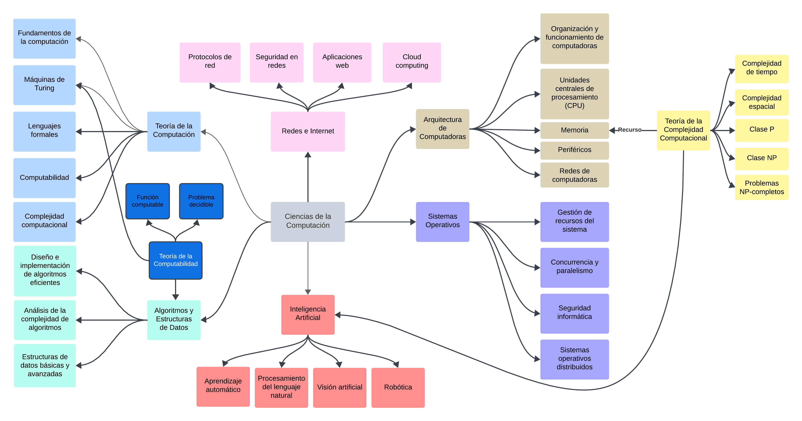
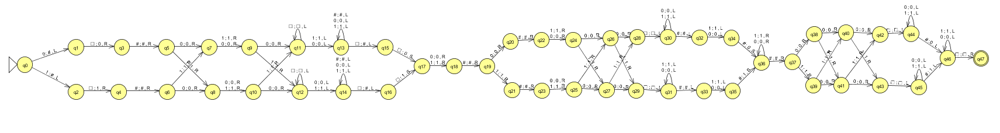
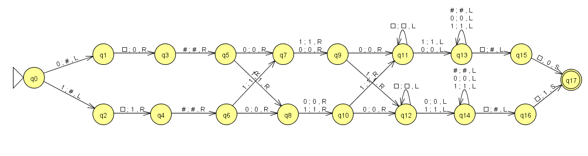
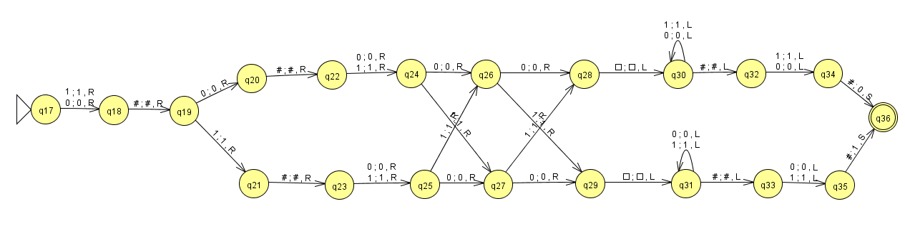
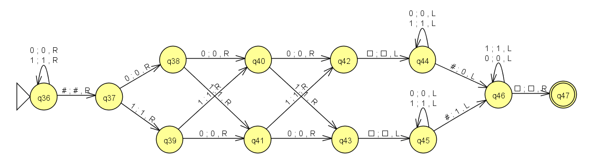
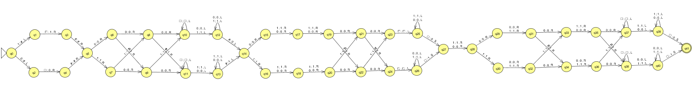
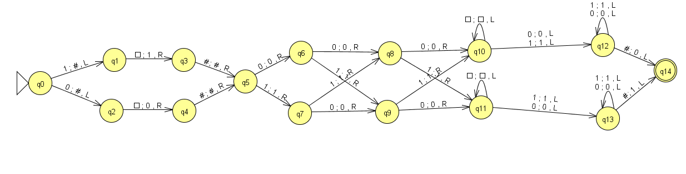
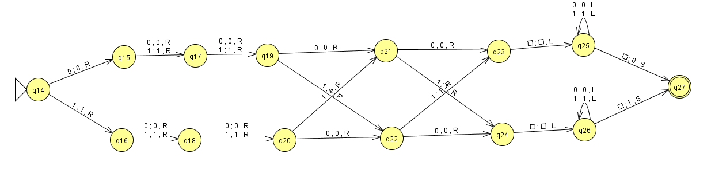
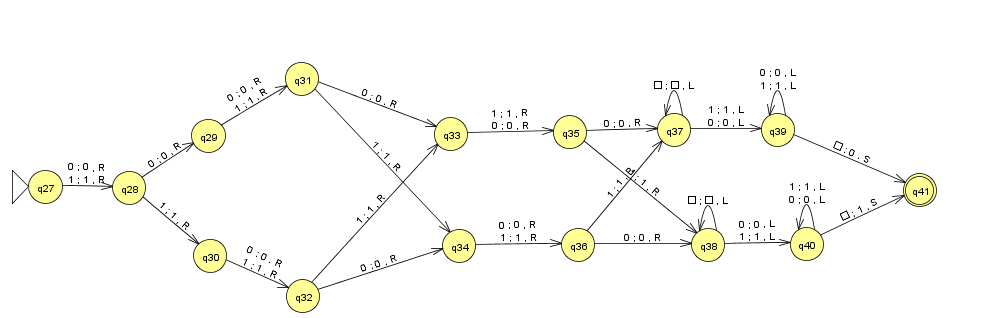

# Máquina de Turing: Hamming de 4 bits

* El objetivo es diseñar una MT que a partir de un dato en binario de 4 bits genere el correspondiente código de Hamming para su posterior transmisión. A este escenario se lo denomina Código Hamming que para el caso particular de un dato de 4 bits, las tres paridades que se deben calcular son:

$$P_1(d_1,d_2,d_4)$$
$$P_2(d_1,d_3,d_4)$$
$$P_3(d_2,d_3,d_4)$$

Esto significa que para el bit de paridad $P_1$ se analizaran los bits de datos $d_1$, $d_2$ y $d_4$ y así con $P_2$ y $P_3$ respectivamente. Además de generar los 3 bits de paridad se deben posicionar en la palabra de salida en las siguiente posiciones:

$$P_1 \quad P_2 \quad d_1 \quad P_3 \quad d_2 \quad d_3 \quad d_4$$

## Estrategias utilizadas

Para lograr este objetivo se plantean dos estrategias diferentes donde en la **estrategia 1** se genera el formato de salida primero con el uso del simbolo auxiliar `#` y luego se reemplaza con las paridades generadas en orden: $P_1$, $P_2$ y $P_3$. Luego en la **estrategia 2** a partir de los 4 bits de entrada se van generando los bits de paridad y formateando la salida a la vez que se va generando las paridades que a partir de una simple inspección del formato el orden que se selecciona es $P_3$, $P_2$ y $P_1$.

## Estrategia 1

### Función que computa

Generar un Codigo Hamming 7,4 a partir de 4 bits de datos se generan 3 bits de paridad par en función de 3 de los 4 bits de entrada

### JFLAP

### Simulator

[Programa](./resources/E1-simulator.mt)

### Inputs

  | Entrada | Salida   | Pasos | Espacios | Estado  |
  |:--------|:--------:|:-----:|:--------:|:--------|
  | 0000    | 0000000  |  43   |    9     | Aceptado|
  | 1000    | 1110000  |  43   |    9     | Aceptado|
  | 0100    | 1001100  |  43   |    9     | Aceptado|
  | 1100    | 0111100  |  43   |    9     | Aceptado|
  | 0010    | 0101010  |  43   |    9     | Aceptado|
  | 1010    | 1011010  |  43   |    9     | Aceptado|
  | 0110    | 1100110  |  43   |    9     | Aceptado|
  | 1110    | 0010110  |  43   |    9     | Aceptado|
  | 0001    | 1101001  |  43   |    9     | Aceptado|
  | 1001    | 0011001  |  43   |    9     | Aceptado|
  | 0101    | 0100101  |  43   |    9     | Aceptado|
  | 1101    | 1010101  |  43   |    9     | Aceptado|
  | 0011    | 1000011  |  43   |    9     | Aceptado|
  | 1011    | 0110011  |  43   |    9     | Aceptado|
  | 0111    | 0001111  |  43   |    9     | Aceptado|
  | 1111    | 1111111  |  43   |    9     | Aceptado|

* **Complejidad Temporal**: el tiempo de ejecución $t_H1(n)$ de la estrategia 1, para tamaño de la entrada $n=4$

$$t_{H1}(4) = 43$$

* **Complejidad Espacial**: el espacio de ejecución $e_{H1}(n)$ de la estrategia 1, para el tamaño de la entrada de $n=4$

$$e_{H1}(4) = 9$$

### Descripción de Estrategia 1

Comenzando con los 4 bit de entraga se posicionan los carcteres auxiliares `#` en los lugares correspondientes para el formato deseado. Luego se genera el $P_1$.

* Entrada: $d_1 \quad d_2 \quad d_3 \quad d_4$
* Salida: $P_1 \quad \# \quad d_1 \quad \# \quad d_2 \quad d_3 \quad d_4$

Se genera $P_2$ y se reemplaza el `#` correspondiente según el formato.

* Entrada: $P_1 \quad \# \quad d_1 \quad \# \quad d_2 \quad d_3 \quad d_4$
* Salida: $P_1 \quad P_2 \quad d_1 \quad \# \quad d_2 \quad d_3 \quad d_4$

Se genera $P_3$ y se reemplaza el `#` correspondiente según el formato y se posiciona al comienzo de la cadena el cabezal.

* Entrada: $P_1 \quad P_2 \quad d_1 \quad \# \quad d_2 \quad d_3 \quad d_4$
* Salida: $P_1 \quad P_2 \quad d_1 \quad P_3 \quad d_2 \quad d_3 \quad d_4$

## Estrategia 2

### Función que computa 2

Generar un Codigo Hamming 7,4 a partir de 4 bits de datos se generan 3 bits de paridad par en función de 3 de los 4 bits de entrada.

### JFLAP 2

### Simulator 2

[Programa](./resources/E2-simulator.mt)

### Inputs 2

| Entrada | Salida   | Pasos | Espacios | Estado  |
|:--------|:--------:|:-----:|:--------:|:--------|
| 0000    | 0000000  |  37   |    8     | Aceptado|
| 1000    | 1110000  |  37   |    8     | Aceptado|
| 0100    | 1001100  |  37   |    8     | Aceptado|
| 1100    | 0111100  |  37   |    8     | Aceptado|
| 0010    | 0101010  |  37   |    8     | Aceptado|
| 1010    | 1011010  |  37   |    8     | Aceptado|
| 0110    | 1100110  |  37   |    8     | Aceptado|
| 1110    | 0010110  |  37   |    8     | Aceptado|
| 0001    | 1101001  |  37   |    8     | Aceptado|
| 1001    | 0011001  |  37   |    8     | Aceptado|
| 0101    | 0100101  |  37   |    8     | Aceptado|
| 1101    | 1010101  |  37   |    8     | Aceptado|
| 0011    | 1000011  |  37   |    8     | Aceptado|
| 1011    | 0110011  |  37   |    8     | Aceptado|
| 0111    | 0001111  |  37   |    8     | Aceptado|
| 1111    | 1111111  |  37   |    8     | Aceptado|

* **Complejidad Temporal**: el tiempo de ejecución $t_{H2}(n)$ de la estrategia 2, para tamaño de la entrada $n=4$

$$t_{H2}(4) = 37$$

* **Complejidad Espacial**: el espacio de ejecución $e_{H2}(n)$ de la estrategia 2, para el tamaño de la entrada de $n=4$

$$e_{H2}(4) = 8$$

#### Descripción de Estrategia 2

Como pasos a realizar para obtener el objetivo nos propusimos los siguientes pasos:

1. Diseñar las MT que generen los bits de Paridad al final del dato de 4 bits
2. Diseñar las MT que generen los bits de Paridad en la posición correspondiente a la salida deseada.
3. Interconectar las MT generadas anteriormente donde cada estado final es el estado incial de la siguiente máquina.

### Las MT que generan los bits de Paridad en la posición correspondiente a la salida deseada

En este caso se tiene como regla generar terminar con el cabezal en la posicion de la cinta más a la izquiera donde haya un dato válido.

En principio se decidio comenzar generando $P_3$, posicionarlo entre los bits de datos $d_1$ y $d_2$ esto es:

Entrada: $d_1 d_2 d_3 d_4$

Salida: $d_1 P_3 d_2 d_3 d_4$

Entrada: $d_1 P_3 d_2 d_3 d_4$

Salida: $P_2 d_1 P_3 d_2 d_3 d_4$

Entrada: $P_2 d_1 P_3 d_2 d_3 d_4$

Salida: $P_1 P_2 d_1 P_3 d_2 d_3 d_4$

* **Comparación de ambas máquinas, justificando cual es la "mejor"**:

Luego de los análisis de ambas MT podemos resumir en la siguiente tabla

|      MT      | Complejidad Espacial | Complejidad Temporal |
|:------------:|:--------------------:|:--------------------:|
| Estrategia 1 | $e_{H1}(4) = 9$      | $t_{H1}(4) = 43$     |
| Estrategia 2 | $e_{H2}(4) = 8$      | $t_{H2}(4) = 37$     |

Podemos concluir que en ambos criterios de evaluación de la complejidad del algoritmo tanto espacial como temporal, la estrategia 2 es la más óptima, más rapida, y la que menos recursos necesita.
