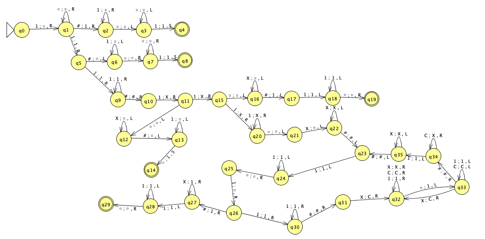
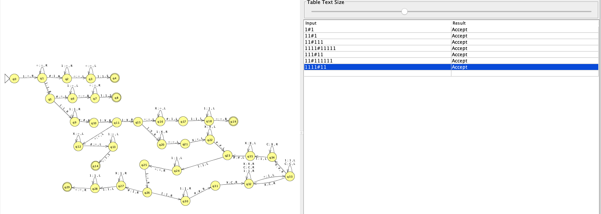

# Máquina de Turing: Multiplicación de unarios

## Nombre

Máquina de Turing para la Multiplicación Unaria

## Función que Computa

La máquina toma dos números en notación unaria, representados por secuencias de '1's separadas por '#', y calcula su **producto en unario**

## Ejemplos de Entrada y Salida

| Entrada (unaria)   | Salida (unaria)  |
| ----------------   | ---------------  |
| 1111#111 (3×2)     | 1111111 (6)      |
| 111#111 (2×2)      | 11111 (4)        |
| 1111#1111 (3×3)    | 1111111111 (9)   |

## Descripción y estrategia mejorada

La máquina de Turing realiza la multiplicación de dos números representados en **notación unaria**. Cada número está formado por una secuencia de '1's y está separado por el símbolo '#'. El objetivo es calcular el producto de estos dos números y escribir el resultado en la cinta, utilizando también notación unaria.

---

## Estrategia de Multiplicación

La máquina de Turing sigue estos pasos para realizar la multiplicación:

1. Identificación de los Operandos: se escanea la entrada para localizar los dos operandos, identificando el primer número antes del '#' y el segundo después de este.
2. Copia del Primer Operando
    * Se recorre el primer operando ('n' unos)
    * Se copia 'n' veces según la cantidad de '1's en el segundo operando ('m')
3. Uso de Marcadores Auxiliares ('X' y 'C')
    * 'X': Se usa temporalmente para marcar los '1's procesados y evitar contarlos nuevamente
    * 'C': Se usa para indicar la finalización del proceso de copiado de un grupo de '1's
4. Construcción del Resultado
    * Los '1's copiados se reubican al final de la cinta, representando la multiplicación
    * Se eliminan los marcadores auxiliares y cualquier otro carácter sobrante
5. Finalización y Limpieza: una vez terminado el proceso de multiplicación, la máquina vuelve a su estado final y detiene la ejecución, dejando únicamente la respuesta en unario en la cinta

## Ejemplo de Ejecución Paso a Paso

**Entrada:** '111#11' (2 × 1)  
**Pasos:**

1. Se identifica 'n=2' ('111') y 'm=1' ('11').
2. Se recorre '111', y por cada '1' encontrado, se copia '111' dos veces.
3. Se eliminan los símbolos auxiliares.  
   **Salida esperada:** '111' (2 en unario).

* Este enfoque garantiza que el resultado refleja correctamente la operación de multiplicación en un sistema sin ceros, basado únicamente en la cantidad de '1's.

---

## JFlap

## Simulator

[Programa Simulator](resources/simulator.mt)

## Inputs

| Entrada       | n (decimal) | m (decimal) | Multiplicación (n×m) | Salida esperada          | Espacios | Pasos | Estado   |
| ------------- | ----------- | ----------- | -------------------- | ------------------------ | -------- | ----- | -------- |
| 1111#11       | 3           | 1           | 3 × 1 = 3            | 1111                     | 15       | 15    | Aceptado |
| 11111#11111   | 4           | 4           | 4 × 4 = 16           | 11111111111111111        | 22       | 285   | Aceptado |
| 111111#111111 | 5           | 5           | 5 × 5 = 25           | 111111111111111111111111 | 35       | 630   | Aceptado |
| 111111#1111   | 5           | 3           | 5 × 3 = 15           | 1111111111111111         | 25       | 286   | Aceptado |
| 111111#111    | 5           | 2           | 5 × 2 = 10           | 11111111111              | 20       | 174   | Aceptado |
| 11#111        | 1           | 2           | 1 × 2 = 2            | 111                      | 6        | 7     | Aceptado |
| 111#1111      | 2           | 3           | 2 × 3 = 6            | 1111111                  | 11       | 61    | Aceptado |
| 11111#111111  | 4           | 5           | 4 × 5 = 20           | 111111111111111111111    | 29       | 403   | Aceptado |
| 11#111111     | 1           | 5           | 1 × 5 = 5            | 111111                   | 9        | 7     | Aceptado |
| 111111#11     | 5           | 1           | 5 × 1 = 5            | 111111                   | 10       | 19    | Aceptado |

## Cálculo de Complejidades en la Máquina de Turing

Se evalúa la complejidad **espacial** y **temporal** de la máquina de Turing utilizando datos de entrada. A partir de estos, se pueden obtener fórmulas matemáticas que describen su comportamiento.

### Complejidad Espacial

Para los casos base usamos la siguientes formulas:

* S(n,m) = { si (n = 0 ∨ n = 1 ) -> m + 4}
* S(n,m) = { si n > 0 ∧ (m = 0 ∨ m=1 ) -> n + 5 }

Y para el caso de multiplicacion donde n es mayor a 1 y m es mayor a 1:

* F(n,m) ={ si n,m >1 -> n\*m + n+2 }

### Complejidad Temporal

La complejidad temporal para esta máquina solo se puede calcular de forma exacta cuando _n_ o _m_ valen 0(1u) o 1(11u)

Cuando _n_ y _m_ son mayores a 1 no se puede calcular de forma exacta la cantidad de pasos que le toma la maquina de Turing computar ya que es alealtoria

**Reglas de cálculo:**

* **CAS0 base “n=0”**

  * T(n,m) = { si n = 0 -> (2\*m)+5 }

* **CAS0 base “n=1”**

  * T(n,m) = { si n = 1 -> 7}

* **CAS0 base “ n > 1 ∧ m=0”**

  * T(n,m) = { si n >1 ∧ m=0 -> 2\*n +6}

* **CAS0 base “ n > 1 ∧ m=1”**

  * T(n,m) = { si n >1 ∧ m=1 -> 2\*n + 9}

* **CAS0S donde “ n , m > 1”**

Para estos casos el incremento de los pasos es alealtorio, no sigue un orden lineal

### Ejemplos de tiempos de ejecución

| Multiplicación unaria | Pasos (tiempo) |
| --------------------- | -------------- |
| 111#111               | 45             |
| 111#1111              | 61             |
| 111#11111             | 81             |
| 1111#111              | 78             |
| 1111#1111             | 116            |
| 1111#11111            | 166            |
