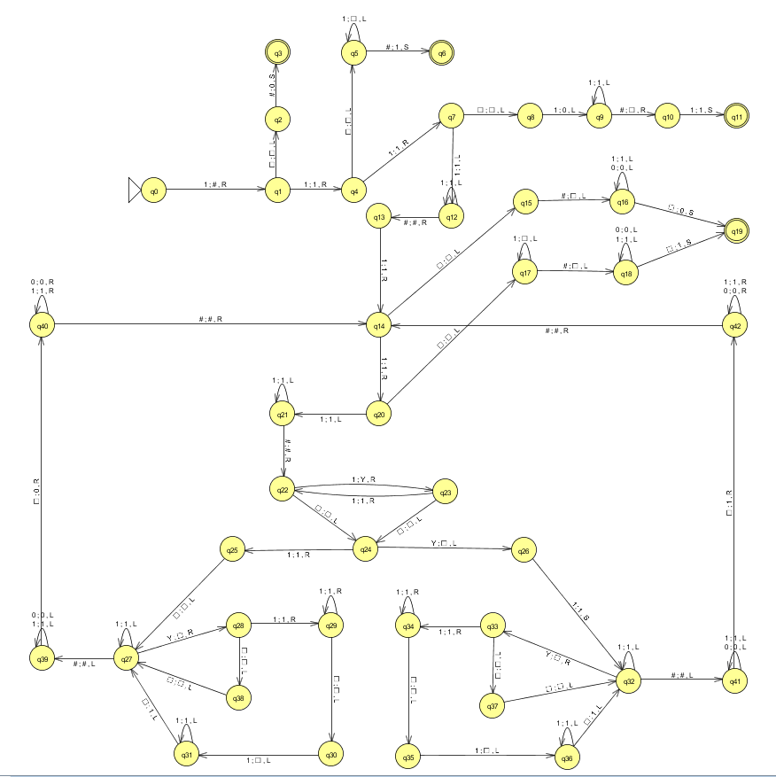
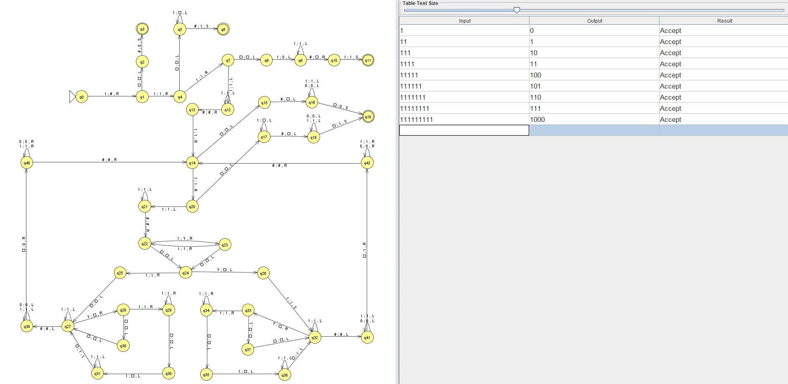
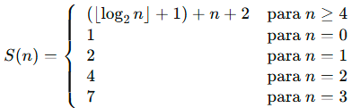
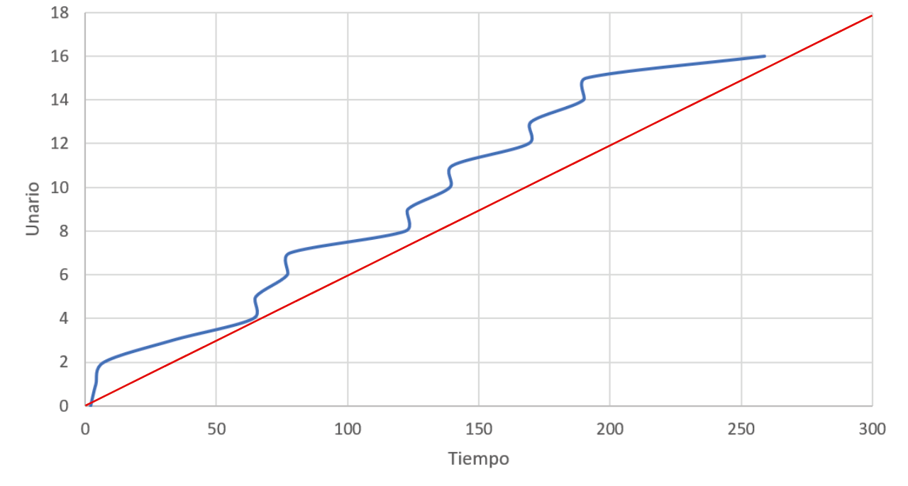

# Máquinas de Turing: Unario a Binario

A continuación se presentara una maquina de turing que realiza la conversion de un input unario a binario. Se análiza su funcionamiento, se detalla su formalización, su comportamiento.

- **Nombre**: "Máquina de Turing de Conversión Unario a Binario"
- **Función que computa**: La función que computa esta máquina es convertir un número en representación unaria a binario. Por ejemplo:

| unario    | binario |
| --------- | ------- |
| 1         | 0       |
| 11        | 1       |
| 111       | 10      |
| 1111      | 11      |
| 11111     | 100     |
| 111111    | 101     |
| 1111111   | 110     |
| 11111111  | 111     |
| 111111111 | 1000    |

**Descripción y estrategia**: Esta maquina de turing toma unarios y los divide por 2 almacenando restos para que luego se leen al reves y poder formar el número binario.

La máquina lo primero que hace es cambiar el primer 1 por un #, pero existen casos base, porque si como siguiente a este no existe otro _1_ borra el # y resuelve como _0_ en binario. Existen casos bases similares para el 1 y 10 en binario.

Para los números siguientes la maquina reemplaza el primer digito por un # para separar los restos del lado izquierdo y las divisiones del lado derecho:

Ejemplo con número 11111 (_4_ en decimal o lo que es lo mismo _100_ binario):

- 11111 => #1111 - luego de hacer la comprobación de casos base, el primer digito cambia por un # y avanza derecha.
- #Y1Y1 - El cabezal avanza y cambia alternando cada 2 pasos el digito 1 por una _Y_, cuando llega al final si el ultimo digito era _1_ antes de leer blanco, entonces el resto es _0_, en cambio si el ultimo era una _Y_, entonces el resto es _1_, el cual ya se puede almacenar del lado de los restos.
- #Y1b1 - Al volver va a ir eliminando las _Y_ para representar la división por 2, se reacomodando _1s_, dejando b (blanco) y moviendo _1s_
- #11 - resultado final luego del reacomodo
- 0#11 - almacena el resto y divide de nuevo
- 0#Y1 - realiza nueva mente la comprobación de la última lectura y determina que el resto es _0_
- 00#1 - Por último, antes de entrar a alternar _Ys_ comprueba si luego del # hay un solo digito o ninguno, para determinar inmediatamente el ultimo resto, Si luego del # hay b(blanco) el resto es _0_, sino es _1_
- 100 - ahora por último elimina los de números y _#_ derechos, y almacena el resto en la izquierda

- **Formalismo**: MT = < Г, Σ, b, Q, q_0, F, δ>
  - Alfabeto de la cinta: Г = {1, 0, Y, b, #}
  - Alfabeto de entrada: Σ = {1}
  - Símbolo blanco: b = b
  - Conjunto de estados: Q = {q0, q1, q2, q3, q4, q5, q6, q7, q8, q9, q10, q10, q11, q12, q13, q14, q15, q16, q17, q18, q19,q20, q21, q22, q23, q24, q25, q26, q27, q28, q29, q30, q31, q32, q33, q34, q35, q36, q37, q38, q39, q40, q41, q42}
  - Estado inicial: q0 = q0
  - Estados finales: F = {q3, q6, q11, q19}
  - Transiciones: δ = {
    - δ(q0, 1) = (q1, #, R),
    - δ(q1, 1) = (q4, 1, R),
    - δ(q1, b) = (q2, b, L),
    - δ(q2, #) = (q3, 0, S),
    - δ(q4, b) = (q5, b, L),
    - δ(q4, 1) = (q7, 1, R),
    - δ(q5, 1) = (q5, b, L),
    - δ(q5, #) = (q6, 1, S),
    - δ(q7, b) = (q8, b, L),
    - δ(q7, 1) = (q12, 1, L),
    - δ(q8, 1) = (q9, 0, L),
    - δ(q9, 1) = (q9, 1, L),
    - δ(q9, #) = (q10, b, R),
    - δ(q10, 1) = (q11, 1, S),
    - δ(q12, 1) = (q12, 1, L),
    - δ(q12, #) = (q13, #, R),
    - δ(q13, 1) = (q14, 1, R),
    - δ(q14, b) = (q15, b, L),
    - δ(q14, 1) = (q20, 1, R),
    - δ(q15, #) = (q16, b, L),
    - δ(q16, 1) = (q16, 1, L),
    - δ(q16, 0) = (q16, 0, L),
    - δ(q16, b) = (q19, 0, S),
    - δ(q17, 1) = (q17, b, L),
    - δ(q17, #) = (q18, b, L),
    - δ(q18, 1) = (q18, 1, L),
    - δ(q18, 0) = (q18, 0, L),
    - δ(q18, b) = (q19, 1, S),
    - δ(q20, b) = (q17, b, L),
    - δ(q20, 1) = (q21, 1, L),
    - δ(q21, 1) = (q21, 1, L),
    - δ(q21, #) = (q22, #, R),
    - δ(q22, 1) = (q23, Y, R),
    - δ(q22, b) = (q24, b, L),
    - δ(q23, 1) = (q22, 1, R),
    - δ(q23, b) = (q24, b, L),
    - δ(q24, 1) = (q25, 1, R),
    - δ(q24, Y) = (q26, b, L),
    - δ(q25, b) = (q27, b, L),
    - δ(q26, 1) = (q32, 1, S),
    - δ(q27, 1) = (q27, 1, L),
    - δ(q27, #) = (q39, #, L),
    - δ(q27, Y) = (q28, b, R),
    - δ(q28, 1) = (q29, 1, R),
    - δ(q28, b) = (q38, b, L),
    - δ(q29, 1) = (q29, 1, R),
    - δ(q29, b) = (q30, b, L),
    - δ(q30, 1) = (q31, b, L),
    - δ(q31, 1) = (q31, 1, L),
    - δ(q31, b) = (q27, 1, L),
    - δ(q32, Y) = (q33, b, R),
    - δ(q32, 1) = (q32, 1, L),
    - δ(q32, #) = (q41, #, L),
    - δ(q33, 1) = (q34, 1, R),
    - δ(q33, b) = (q37, b, L),
    - δ(q34, 1) = (q34, 1, R),
    - δ(q34, b) = (q35, b, L),
    - δ(q35, 1) = (q36, b, L),
    - δ(q36, 1) = (q36, 1, L),
    - δ(q36, b) = (q32, 1, L),
    - δ(q37, b) = (q32, b, L),
    - δ(q38, b) = (q27, b, L),
    - δ(q39, 1) = (q39, 1, L),
    - δ(q39, 0) = (q39, 0, L),
    - δ(q39, b) = (q40, 0, R),
    - δ(q40, 1) = (q40, 1, R),
    - δ(q40, 0) = (q40, 0, R),
    - δ(q40, #) = (q14, #, R),
    - δ(q41, 1) = (q41, 1, L),
    - δ(q41, 0) = (q41, 0, L),
    - δ(q41, b) = (q42, 1, R),
    - δ(q42, 1) = (q42, 1, R),
    - δ(q42, 0) = (q42, 0, R),
    - δ(q42, #) = (q14, #, R),
    - }
- **Diseño en JFlap**:
- 
- **Comprobaciones**:
  
- **Tabla con x10 inputs**:

  |n (decimal) | Conf. inicial | Conf. final | Pasos | Espacios | Estado |
  | --- | --- | --- | --- | --- | --- |
  | 0 | 1 | 0 | 2 | 2 | Aceptado |
  | 1 | 11 | 1 | 4 | 3 | Aceptado |
  | 2 | 111 | 10 | 7 | 4 | Aceptado |
  | 3 | 1111 | 11 | 33 | 7 | Aceptado |
  | 4 | 11111| 100 | 64 | 9 | Aceptado |
  | 5 | 111111 | 101 | 65 | 10 | Aceptado |
  | 6 | 1111111 | 110 | 77 | 11 | Aceptado |
  | 7 | 11111111 | 111 | 78 | 12 | Aceptado |
  | 8 | 111111111 | 1000 | 122 | 14 | Aceptado |
  | 9 | 1111111111 | 1001 | 123 | 15 | Aceptado |

- **Programa Simulator**: [Programa Simulator](https://turingmachinesimulator.com/shared/jlyefvhecl)
- **Programa Prolog**: [Programa Prolog](./resources/unary-to-binary.pl)

## **Calculos de complejidades computacional en la máquinas de Turing**

Se evalúa en términos de su complejidad espacial y temporal, usando datos de entrada para luego obtener un gráfico que forma una asíntota y también su fórmula matemática.

### **Complejidad Espacial**

- S(n) = { (​⌊log2(​n)⌋ + 1) + n + 2 / n ≥ 4 } U { 1 / n = 0 } U { 2 / n = 1 } U { 4 / n = 2 } U { 7 / n = 3 }
- 

| Espacio | n   |
| ------- | --- |
| 2       | 0   |
| 3       | 1   |
| 4       | 2   |
| 7       | 3   |
| 9       | 4   |
| 10      | 5   |
| 11      | 6   |
| 12      | 7   |
| 14      | 8   |
| 15      | 9   |
| 16      | 10  |
| 17      | 11  |
| 18      | 12  |
| 19      | 13  |
| 20      | 14  |
| 21      | 15  |
| 22      | 16  |
| 40      | 32  |
| 73      | 64  |
| 138     | 128 |
| 267     | 256 |

La función tiene números específicos para los números 0, 1, 2, 3, pero a partir de ahi, se calcula el espacio binario usando función piso sobre el Log base 2, sumando la cantidad de 1s del unario + 2 que representan al 0 y un espacio adicional que necesita la maquina cuando está recorriendo

En términos de complejidad espacial es 𝑂(𝑛), ya que crece linealmente.

### **Complejidad Temporal**

| n   | Pasos (Tiempo) | Representación unaria |
| --- | -------------- | --------------------- |
| 0   | 2              | 1                     |
| 1   | 4              | 11                    |
| 2   | 7              | 111                   |
| 3   | 33             | 1111                  |
| 4   | 64             | 11111                 |
| 5   | 65             | 111111                |
| 6   | 77             | 1111111               |
| 7   | 78             | 11111111              |
| 8   | 122            | 111111111             |
| 9   | 123            | 1111111111            |
| 10  | 139            | 11111111111           |
| 11  | 140            | 111111111111          |
| 12  | 169            | 1111111111111         |
| 13  | 170            | 11111111111111        |
| 14  | 190            | 111111111111111       |
| 15  | 191            | 1111111111111111      |
| 16  | 259            | 11111111111111111     |

La complejidad temporal para esta máquina es aleatoria, y viendo la línea recta que representa un crecimiento lineal 𝑂(𝑛), se concluye que el crecimiento de la complejidad es superior a la lineal.

Al ser tan errática no existe una función exacta simple que pueda calcular la complejidad temporal de la máquina de Turing ya que en ciertos casos la maquina incrementa rápidamente su cantidad de pasos (tiempo), cuando el número _n_ se incrementa.

Lo único que se puede observar es que luego de _n_ = 3 despues de un número impar la complejidad temporal salta de forma aleatorio hasta el número que sigue (par), pero su siguiente número (el impar), solo aumenta su valor en 1.

- **Para valores pequeños de n** (como 0, 1, 2), los pasos son bastante pequeños y parecen comportarse de manera casi constante o lineal.

- **Para valores grandes de n**, el número de pasos crece de manera mucho más acelerada, lo que sugiere un **crecimiento no lineal**.

- A medida que n aumenta, los pasos necesarios aumentan significativamente, lo que indica que el número de movimientos del cabezal y las escrituras/lecturas también aumentan de forma rápida.

Puedo asumir que la complejidad temporal está **por encima de la lineal**, pero no es posible calcular la complejidad exacta con una única fórmula sencilla. A partir de los datos, podemos aproximar la complejidad temporal como O(n^2),
